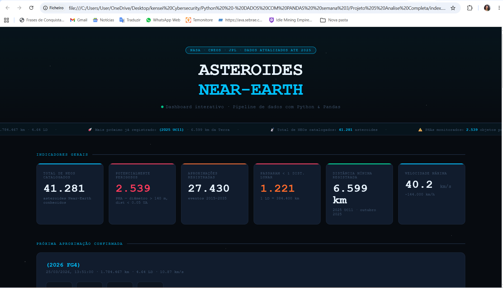
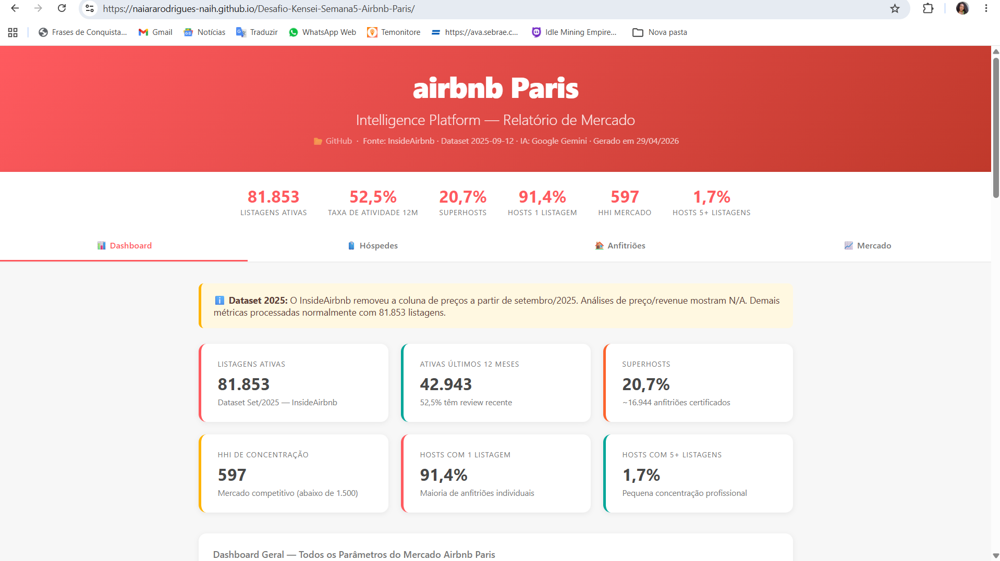
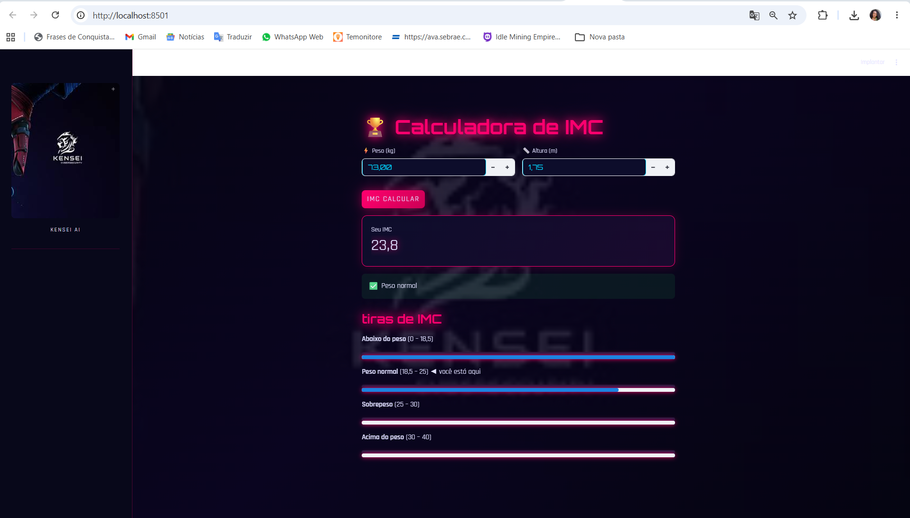
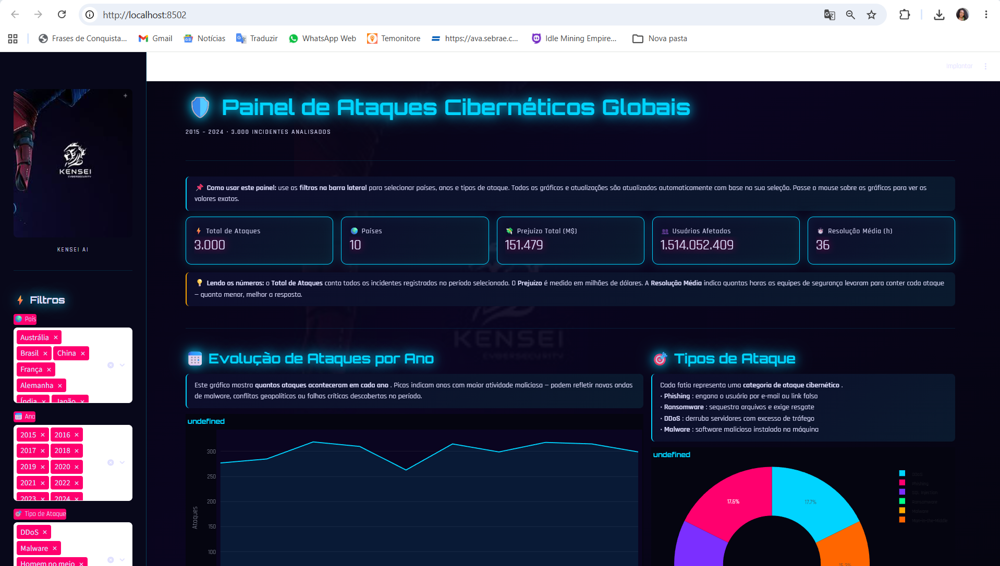
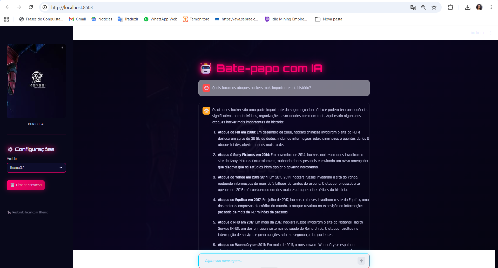
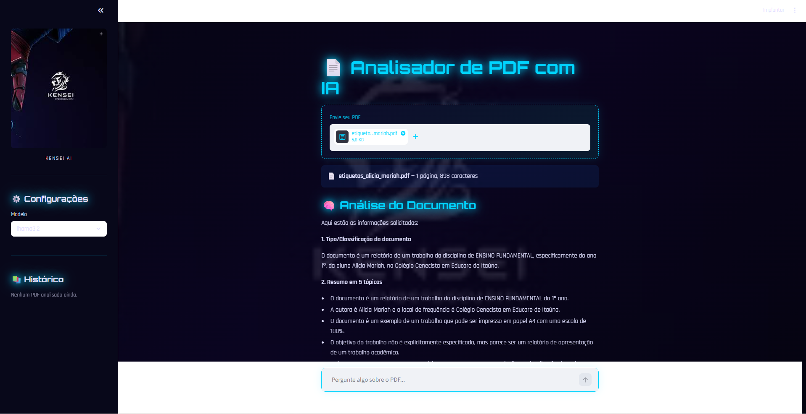
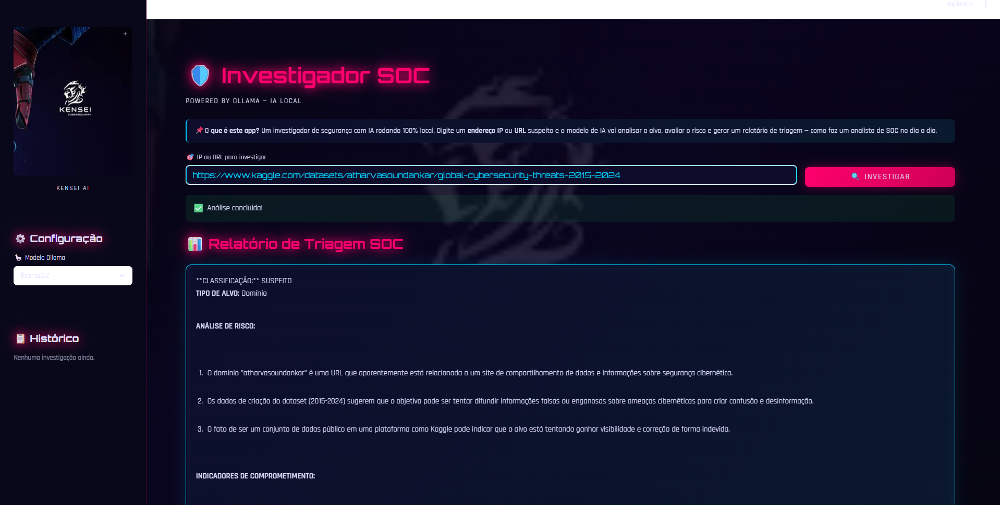

# Relatório do Curso — Trilha D
## Kensei AI Foundations 2026

**Nome:** Naiara Rodrigues  
**Turma:** Kensei AI Foundations 2026  
**Data:** Junho de 2026  
**GitHub:** [github.com/NaiaraRodrigues-naih](https://github.com/NaiaraRodrigues-naih)

---

## 1. Resumo por Semana

### Semana 1 — IA na Prática + Primeiro Repositório no GitHub
Aprendi o que é Prompt Engineering e como usar LLMs no dia a dia como ferramentas reais de trabalho. Criei meu primeiro repositório no GitHub e entendi como versionar código. 

> **Insight pessoal:** Foi empolgante e desafiador ao mesmo tempo — eu não sabia direito como fazer, mas consegui. Antes do curso, acreditava que programar era coisa de quem já sabia; sendo estudante do segundo período da faculdade, não achava possível — e essa semana provou que eu estava errada.

---

### Semana 2 — Python do Zero com Copiloto IA
Escrevi meus primeiros scripts Python com IA como copiloto: variáveis, listas, dicionários, condicionais e loops. Aprendi que programar com IA é uma habilidade diferente de programar sozinha — é saber fazer as perguntas certas.

> **Insight pessoal:** Quando não estava entendendo o código, pedi à IA para explicar o que estava fazendo — e foi aí que tudo começou a se encaixar. Aprendi que saber o que pedir à IA é o maior desafio: você precisa saber comunicar exatamente o que espera do projeto.

---

### Semana 3 — Dados com Pandas e Visualização
Trabalhei com dados reais usando Pandas: limpeza, análise e geração de gráficos interativos. Publiquei um dashboard online com dados da NASA sobre asteroides próximos da Terra.

> **Insight pessoal:** Quando vi o dashboard funcionando online com dados reais da NASA, meu cérebro explodiu — não acreditei que tinha conseguido. O Pandas me surpreendeu pela quantidade de coisas que dá para fazer com dados reais.

---

### Semana 4 — APIs de IA com Google Gemini
Conectei scripts Python com a API do Google Gemini, fazendo meus programas "pensarem" com IA de verdade. Aprendi a usar variáveis de ambiente para proteger credenciais (`.env` + `.gitignore`).

> **Insight pessoal:** A parte de proteger credenciais com `.env` fez muito sentido para mim, pois estou na área de cybersecurity e sei o quanto ataques cibernéticos são comuns hoje. Antes dessa semana eu nem sabia o que era uma API — entender isso abriu um mundo novo que quero continuar explorando cada vez mais.

---

### Semana 5 — Análise de Dados + IA + Dashboard
Construí uma plataforma completa de inteligência de mercado para o Airbnb de Paris: pipeline de dados reais (InsideAirbnb) → análise com Google Gemini → dashboard interativo publicado online. Também aprendi automação com n8n.

> **Insight pessoal:** Esta foi a semana que mais pareceu um projeto de verdade — pegar dados reais do Airbnb de Paris e transformar em um dashboard com análise de IA foi incrível. Foi meu primeiro contato com automação visual no n8n e me empolguei muito; é uma área que quero me aprofundar.

---

### Semana 6 — Agentes de IA com n8n + Claude
Criei 4 agentes de IA usando n8n como orquestrador e Claude (Anthropic) como cérebro: agente generalista, pesquisador web, analista de CSV e um agente avançado. Aprendi que agentes são programas que tomam decisões e usam ferramentas sozinhos.

> **Insight pessoal:** O agente de geração de e-mails me impressionou pela capacidade de reduzir o trabalho inicial — é algo extremamente útil para escritórios e empresas. Fiquei impressionada com o potencial desses programas e percebi que agentes de IA têm aplicação real e imediata no mercado de trabalho.

---

### Semana 7 — Apps Web com Streamlit
Construí 5 aplicações web completas com Python + Streamlit, transformando scripts em produtos usáveis por qualquer pessoa, sem precisar saber programar.

> **Insight pessoal:** Ver scripts Python se transformarem em apps web que qualquer pessoa pode usar foi o que eu mais amei no curso — é muito gratificante ver funcionando. O Chatbot com IA, a Calculadora IMC e o Analisador de PDF foram os projetos de que mais me orgulho, e mostraria para qualquer pessoa sem hesitar.

---

### Semana 8 — Desafio Final e Certificação
Entreguei o relatório completo das 8 semanas (Trilha D) e os 5 apps Streamlit como projeto principal (Trilha A), consolidando tudo que aprendi no curso.

> **Insight pessoal:** Quero agradecer ao Zé, à Kensei, ao Gilson e a todos os colegas pela oportunidade de compartilhar conhecimento — aprendi muito com cada um. Estou em transição de carreira, saindo da área comercial e de vendas para TI, e este curso foi um passo enorme nessa jornada. Quero continuar na comunidade e absorver todo o conhecimento possível.

---

## 2. Os Projetos que Construí

---

### Semana 1 — IA na Prática + Primeiro Repositório no GitHub
[Ver projeto no GitHub](https://github.com/NaiaraRodrigues-naih/IA-na-pratica-primeiro-repo-Github)

---

### Semana 2 — Python do Zero com Copiloto IA
[Ver projeto no GitHub](https://github.com/NaiaraRodrigues-naih/PYTHON-DO-ZERO-COM-COPILOTO-IA)

---

### Semana 3 — Dados com Pandas: Dashboard de Asteroides Near-Earth (NASA)
[Ver projeto no GitHub](https://github.com/NaiaraRodrigues-naih/PYTHON-SEMANA-03-DADOS-COM-PANDAS)

---

### Semana 4 — APIs de IA com Google Gemini
[Ver projeto no GitHub](https://github.com/NaiaraRodrigues-naih/APIs-DE-IA-Conectando-Python-com-Inteligencia-Artificial---semana-4)

---

### Semana 5 — Airbnb Paris: Plataforma de Inteligência de Mercado
[Ver projeto no GitHub](https://github.com/NaiaraRodrigues-naih/Desafio-Kensei-Semana5-Airbnb-Paris) · [Automação n8n](https://github.com/NaiaraRodrigues-naih/kensei-n8n-automacao-semana5)

---

### Semana 6 — Agentes de IA com n8n + Claude
[Ver projeto no GitHub](https://github.com/NaiaraRodrigues-naih/Python-n8n-IA-AGENTES-semana-6)

---

### Semana 7 — 5 Apps Web com Streamlit
[Ver projeto no GitHub](https://github.com/NaiaraRodrigues-naih/semana-7-apps-com-streamlit)

**App 1 — Calculadora de IMC**

**App 2 — Painel de Ataques Cibernéticos Globais**

**App 3 — Bate-papo com IA**

**App 4 — Analisador de PDF com IA**

**App 5 — Investigador SOC**

---

## 3. O que Mudou em Mim

Antes do curso, via a IA apenas como uma ferramenta isolada — algo que respondia perguntas, mas não como um suporte real ao meu trabalho. Hoje entendo que dá para conciliar IA com automação e transformar processos inteiros, do começo ao fim, com muito mais eficiência.

O projeto que eu menos acreditava que conseguiria construir foi o chatbot — criar um app que conversa comigo, com IA rodando por baixo, parecia algo muito distante para quem estava começando do zero. E consegui.

Este curso mudou muito minha visão para o lado positivo: percebi que posso continuar expandindo meus conhecimentos sem limite e que a IA é uma aliada real para facilitar meus estudos, projetos e trabalhos. Estou em transição da área comercial para TI, e esse curso me mostrou que esse caminho é possível — e que eu já estou nele.

---

## 4. Próximos Passos

- **Mês 1:** Aprofundar automação com n8n — construir fluxos que resolvam problemas reais do dia a dia, conectando ferramentas e eliminando trabalho manual.
- **Mês 2:** Desenvolver sites e aplicações web com Streamlit e Python que facilitem a vida das pessoas — foco em produtos simples, funcionais e acessíveis para quem não é da área de tech.
- **Mês 3:** Integrar análise de dados com IA nos projetos — usar Pandas, dashboards interativos e modelos de linguagem para transformar dados brutos em decisões mais inteligentes.

---

*Kensei CyberSec Lab | AI Foundations 2026 — A jornada continua.*
